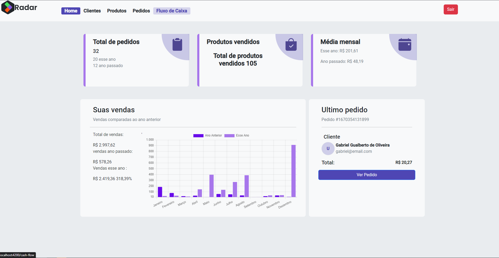

  
  

<h1> PROJETO RADAR - API </h1>
O objetivo do projeto foi ampliar o projeto anterior baseado em Angular, consumindo uma API feita em .NET, incluindo fluxo de campanhas e lojas, que anteriormente não existiam para fornecer uma funcionalidade aprimorada e mais completa para os associados Farmarcas 
 - <a href="#Configurar">Configurar</a>
 - <a href="#Features">Features</a>
 - <a href="#Endpoints">Endpoints</a>
 - <a href="#Navegacao">Navegação (imagens)</a>
 - <a href="#Tecnologias">Tecnologias Utilizadas</a>

<h3> <a href="https://projetoradar.vercel.app/login">Acesse a página:</a> </h3>

       login: convidado@radar.com
       senha: Radar#123

<h3> <a href="https://github.com/Radar-Dotnet/Back-end-api">Repositório da API consumida no projeto</a> </h3>

<h2> 🖥️ Como executar: </h2>
<h4> Após o clone do projeto, navegue até a pasta frontend e execute: </h4>

### Instalando dependências:

      $ npm install

### Levantando aplicação:

      $ ng serve

<h2 id="Features"> 💾Features </h2>

- [x] Página de Login com autenticação para acesso de rotas (🔓 - JWT);
- [x] Página de Cadastro e Edição para todas as entidades utilizando modal (Bootstrap);
- [x] Página de listagem fazendo requisição da API com paginação;
- [x] Página de Cadastro para todas as entidades utilizando modal (Bootstrap);

  <h1> Navegação </h1>

 

<table>
  <thead>
    <tr>
      <th>Descrição da imagem</th>
      <th>Tela</th>
    </tr>
  </thead>
  <tbody>
    <tr>
      <td align = 'center'>Página de login</td>
      <td></td>
    </tr>
    <tr>
      <td align = 'center'>Página Home</td>
      <td>
    </tr>
    <tr>
      <td align = 'center'>Página de Clientes</td>
      <td></td>
    </tr>
    <tr>
      <td align = 'center'>Página de Produtos</td>
      <td></td>
    </tr>
    <tr>
      <td align = 'center'>Página de Pedidos</td>
      <td></td>
    </tr>
    <tr>
      <td align = 'center'>Página de fluxo de caixa, mostrando a movimentação do mês</td>
      <td></td>
    </tr>
    <tr>
      <td align = 'center'>Página de Campanhas</td>
      <td></td>
    </tr>
    <tr>
      <td align = 'center'>Página de Lojas</td>
      <td></td>
    </tr>
  </tbody>
</table>

 
 

<h2>🔚Endpoints:</h2>

## <a href="https://dbradar.up.railway.app/swagger/index.html">Documentação das requisições (API). 📝</a>

<h2>:computer: Desenvolvedores:</h2>
<table>
  <tr>
    <td align="center">
      <a href="https://github.com/99arielsr">
         
        
          <b>Ariel Rodrigues</b>
        
      </a>
    </td>
     <td align="center">
      <a href="https://github.com/DanihBritt0">
         
        
          <b>Daniele Britto</b>
        
      </a>
    </td>
    <td align="center">
      <a href="https://github.com/MotionLeo">
         
        
          <b>Leonardo Daniel</b>
        
      </a>
    </td>
     <td align="center">
      <a href="https://github.com/moysesth">
         
        
          <b>Moyses Thomaz</b>
        
      </a>
    </td>
     <td align="center">
      <a href="https://github.com/Sungjuno">
         
        
          <b>Sung Ju</b>
        
      </a>
    </td>
     <td align="center">
      <a href="https://github.com/Williamalmeida27">
         
        
          <b>William Almeida</b>
        
      </a>
    </td>
  </tr>
</table>

<h2 id="Tecnologias">💻 Tecnologias utilizadas no projeto: <h2>
  <table  align= "center">
   <tr>
   
 </tr>
  </table>  

<h2> 🤝 Agradecimentos </h2>

 Agradecemos à Febrafar/Farmarcas pela oportunidade de participarmos desta bela iniciativa que é o programa de treinamento Código do Futuro, que proporciona a ampliação de conhecimentos e de qualificação na área de desenvolvimento Full Stack - Frontend e Backend (Angular, C#/DotNet). 

